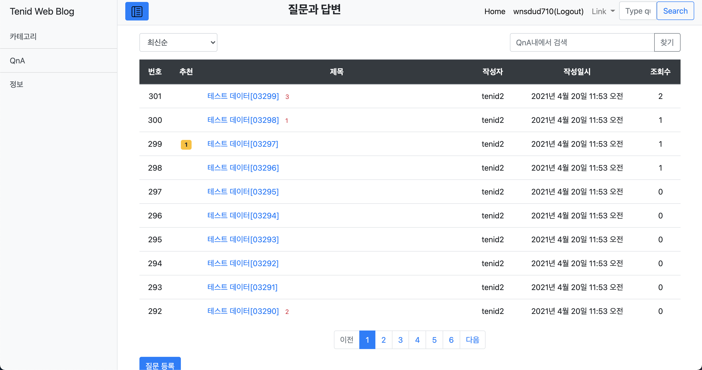

## 질문 목록 (QnA_Index)

- 등록된 모든 질문 리스트를 볼 수 있습니다.
- 페이징을 통해 정해진 갯수별로 질문들을 페이지별로 관리합니다.
- 추천, 조회수, 작성자 등을 확인 할 수 있습니다.

## 질문 등록 (QnA_Create)
 

- Summernote 에디터를 사용하여 게시물을 작성할 수 있습니다.
- 링크, 이미지 업로드, 폰트 조절 등이 가능합니다.

## 질문내용 보기 (QnA_Detail)
 

- 작성했던 질문 내용을 확인할 수 있습니다.
- 질문에 대한 댓글을 작성할 수 있습니다.
- 수정, 삭제가 가능합니다.

## 댓글 (QnA_Comment)
 

- 해당 질문상에서 별도의 질문을 작성할 수 있습니다.
- 추천, 댓글에 다시 댓글을 작성할 수도 있습니다.
- 수정, 삭제가 가능합니다.